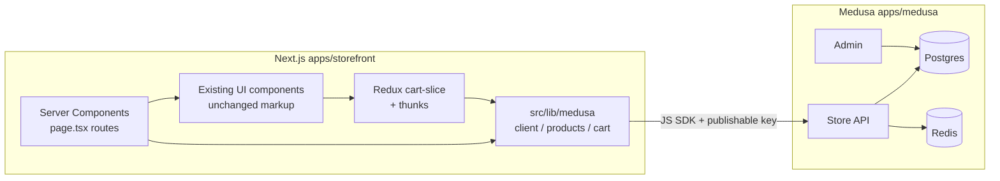

# Medusa Integration Plan — Next.js E-commerce Template

## Phase 0 — Audit Result (Done)

The repository was advertised as a Next.js + Sanity project. **It is not.** Sanity dependencies (`sanity`, `next-sanity`) are listed in [`package.json`](package.json:16) but a recursive search of `src/` for `sanity`, `groq`, `urlFor`, `@sanity`, `SANITY_*`, `sanityClient`, `defineType`, or `defineSchema` returns zero hits. There is no `sanity.config`, no `/studio`, no schema folder, and [`next.config.js`](next.config.js:1) has no Sanity remote patterns.

All commerce data is hardcoded TypeScript:

- [`src/components/Shop/shopData.ts`](src/components/Shop/shopData.ts:1) — 12 products, consumed by 7 components
- [`src/components/Home/Categories/categoryData.ts`](src/components/Home/Categories/categoryData.ts:1)
- [`src/components/BlogGrid/blogData.ts`](src/components/BlogGrid/blogData.ts:1) (editorial — keep static for now)
- [`src/components/Home/Testimonials/testimonialsData.ts`](src/components/Home/Testimonials/testimonialsData.ts:1)
- [`src/components/Orders/ordersData.tsx`](src/components/Orders/ordersData.tsx:1)

The `Product` type ([`src/types/product.ts`](src/types/product.ts:1)) carries `id: number`, `title`, `price`, `discountedPrice`, `reviews`, and `imgs.{thumbnails, previews}` — none of the Sanity-shaped fields the original directive references.

Cart and wishlist already live in Redux Toolkit ([`src/redux/features/cart-slice.ts`](src/redux/features/cart-slice.ts:1), [`src/redux/features/wishlist-slice.ts`](src/redux/features/wishlist-slice.ts:1)). Checkout UI ([`src/components/Checkout/index.tsx`](src/components/Checkout/index.tsx:1)) is a static form with a hardcoded order summary.

**Conclusion:** treat this as a greenfield Medusa integration. Phases 0/3/4/7 of the original directive collapse into a much smaller cleanup. The valuable work is standing up Medusa, building a data-access layer, swapping the static `*Data.ts` files for Medusa fetches, and wiring the Redux cart slice through Medusa's cart API.

## Components Touching `shopData` (Phase 3 surface area)

| File | How it imports |
|------|----------------|
| [`src/components/Home/NewArrivals/index.tsx`](src/components/Home/NewArrivals/index.tsx:5) | `shopData.map(...)` full grid |
| [`src/components/Home/BestSeller/index.tsx`](src/components/Home/BestSeller/index.tsx:5) | `shopData.slice(1, 7)` |
| [`src/components/ShopWithSidebar/index.tsx`](src/components/ShopWithSidebar/index.tsx:10) | `shopData.map(...)` |
| [`src/components/ShopWithoutSidebar/index.tsx`](src/components/ShopWithoutSidebar/index.tsx:9) | `shopData.map(...)` |
| [`src/components/ShopDetails/RecentlyViewd/index.tsx`](src/components/ShopDetails/RecentlyViewd/index.tsx:3) | `shopData.map(...)` |
| [`src/components/BlogDetailsWithSidebar/index.tsx`](src/components/BlogDetailsWithSidebar/index.tsx:8) | `LatestProducts products={shopData}` |
| [`src/components/BlogGridWithSidebar/index.tsx`](src/components/BlogGridWithSidebar/index.tsx:9) | `LatestProducts products={shopData}` |

[`src/components/ShopDetails/index.tsx`](src/components/ShopDetails/index.tsx:1) is 1448 lines and currently renders a single hardcoded product (no `shopData` import) — it must be converted to receive the product as a prop from a Server Component parent.

## Phase 1 — Medusa Backend

Use latest Medusa.

```
npx create-medusa-app@latest --skip-db false
```

Layout choice: convert the repo into a workspace.

```
/
  apps/
    storefront/   <- existing Next.js app moves here
    medusa/       <- new Medusa backend
  package.json    <- workspace root (pnpm or npm workspaces)
```

If moving the Next.js app is too disruptive in one PR, leave it at the root and put Medusa under `/medusa`.

Required steps:
1. PostgreSQL + Redis connection strings in `apps/medusa/.env`.
2. CORS in `apps/medusa/medusa-config.ts`:
   - `STORE_CORS=http://localhost:3000,https://storefront.example.com`
   - `ADMIN_CORS=http://localhost:7001,https://admin.example.com`
3. `medusa db:migrate`
4. `medusa user -e admin@example.com -p ...`
5. Start, log in, generate a publishable API key. Store key in storefront env (`NEXT_PUBLIC_MEDUSA_PUBLISHABLE_KEY`).

## Phase 2 — Storefront Data Layer

```
src/lib/medusa/
  client.ts     // single Medusa SDK instance
  region.ts     // getRegion() with React cache(), default BD/BDT
  types.ts      // StorefrontProduct + re-exports from @medusajs/types
  mappers.ts    // mapMedusaProduct(p, regionId) -> StorefrontProduct
  products.ts   // getProducts, getProductByHandle, getProductById, getCategories, getCollections
  cart.ts       // getOrCreateCart, addLineItem, updateLineItem, removeLineItem, getCart, completeCart
```

Env (Phase 2.2):

```
NEXT_PUBLIC_MEDUSA_BACKEND_URL=http://localhost:9000
NEXT_PUBLIC_MEDUSA_PUBLISHABLE_KEY=pk_...
```

`Product` type ([`src/types/product.ts`](src/types/product.ts:1)) widens:

```ts
export type Product = {
  id: string | number;          // widened
  title: string;
  reviews: number;              // metadata fallback
  price: number;                // calculated_amount
  discountedPrice: number;      // original_amount or calculated_amount
  imgs?: { thumbnails: string[]; previews: string[] };
  handle?: string;              // new
  variantId?: string;           // new — needed for cart line items
  inStock?: boolean;            // new
  metadata?: Record<string, unknown>;
};
```

## Phase 3 — File-by-File Migration

Two patterns:

**Pattern A (preferred) — Server Component parent fetches, client component receives props.**
Used for: `NewArrivals`, `BestSeller`, `ShopWithSidebar`, `ShopWithoutSidebar`, `ShopDetails`, `RecentlyViewd`, `Categories`, `BlogGridWithSidebar`, `BlogDetailsWithSidebar`.

**Pattern B — `shopData.ts` becomes async helper.**
Replace the synchronous `const shopData: Product[] = [...]` default export with `export async function getShopData(): Promise<Product[]>`. Each consumer imports the function and calls it from a Server Component parent. The original file is preserved as a single source of mapping logic but no longer hardcodes products.

New routes:

- [`src/app/(site)/(pages)/shop-details/[handle]/page.tsx`](src/app/(site)/(pages)/shop-details/[handle]/page.tsx) — server component, calls `getProductByHandle(params.handle)`, exports `generateStaticParams()` driven by Medusa.
- [`src/app/(site)/(pages)/shop-with-sidebar/page.tsx`](src/app/(site)/(pages)/shop-with-sidebar/page.tsx) and [`shop-without-sidebar/page.tsx`](src/app/(site)/(pages)/shop-without-sidebar/page.tsx) — server components fetch products and pass to existing client UI.

UI markup is preserved verbatim across all conversions — only data wiring changes.

## Phase 4 — Field Mapping Reference

Source: existing `Product` shape (no Sanity schema to migrate from).

| Storefront field | Medusa source |
|---|---|
| `id` | `product.id` (string) |
| `title` | `product.title` |
| `handle` | `product.handle` |
| `imgs.thumbnails` | `product.images[*].url` (or `[product.thumbnail]`) |
| `imgs.previews` | same as thumbnails or larger variant |
| `price` | `variant.calculated_price.calculated_amount` |
| `discountedPrice` | `variant.calculated_price.original_amount` |
| `inStock` | `variant.inventory_quantity > 0` (or `manage_inventory === false`) |
| `variantId` | `product.variants[0].id` (default for single-variant products) |
| `reviews` | `product.metadata.reviews` (template-only, seeded) |
| storages/sims/types option lists | `product.options` if multi-option, else `product.metadata.options` |

Anything without a Medusa native field goes to `product.metadata` and is read with a safe default in [`src/lib/medusa/mappers.ts`](src/lib/medusa/mappers.ts).

## Phase 5 — Cart and Checkout

The cart slice keeps its public API so consumers do not break.

```ts
// src/redux/features/cart-slice.ts (new shape, same exports)
type CartItem = {
  id: string;             // Medusa line item id
  variantId: string;
  productId: string;
  title: string;
  price: number;          // unit price (calculated)
  discountedPrice: number;
  quantity: number;
  imgs?: { thumbnails: string[]; previews: string[] };
};

type InitialState = {
  cartId: string | null;
  items: CartItem[];
  totals: { subtotal: number; total: number; tax: number; shipping: number };
  status: 'idle' | 'loading' | 'error';
};
```

Add `src/redux/features/cart-thunks.ts`:

- `hydrateCart()` — reads `medusa_cart_id` from localStorage, fetches via SDK
- `addItemToCartAsync({ variantId, quantity })`
- `updateCartItemQuantityAsync({ lineItemId, quantity })`
- `removeItemFromCartAsync(lineItemId)`
- `completeCartAsync()`

Hydration runs from [`src/redux/provider.tsx`](src/redux/provider.tsx:1) on mount.

Synchronous reducers (`addItemToCart`, `removeItemFromCart`, `updateCartItemQuantity`, `removeAllItemsFromCart`) are preserved as thin shims that dispatch the matching thunk, so existing UI dispatch sites keep working with minimal prop changes (they must pass `variantId` going forward).

Checkout:

- [`src/components/Checkout/index.tsx`](src/components/Checkout/index.tsx:1) — replace the hardcoded "iPhone 14 Plus" order summary block with a client subcomponent reading `selectCartItems` and `selectTotalPrice`. UI/className unchanged.
- [`src/components/Checkout/ShippingMethod.tsx`](src/components/Checkout/ShippingMethod.tsx:1) — populate radio options from `cart.shipping_options`; on change, call `cart.addShippingMethod`.
- [`src/components/Checkout/PaymentMethod.tsx`](src/components/Checkout/PaymentMethod.tsx:1) — initialize payment sessions; on change, set the active session.
- Form submit triggers `completeCartAsync()` → success route, clears `medusa_cart_id`.

## Phase 6 — Seed Script

`apps/medusa/src/scripts/seed-storefront.ts`:

- Region: Bangladesh, currency BDT
- Categories from [`src/components/Home/Categories/categoryData.ts`](src/components/Home/Categories/categoryData.ts:1) (Televisions, Laptop & PC, Mobile & Tablets, Games & Videos, Home Appliances, Health & Sports, Watches)
- Products mirroring the 12 entries in [`src/components/Shop/shopData.ts`](src/components/Shop/shopData.ts:1) with prices in BDT (the template currently uses USD; convert via a fixed multiplier or keep USD if the BDT requirement was speculative — confirm at run time)
- Image URLs point at the existing `/images/products/*.png` assets, served through the storefront origin until uploaded to Medusa file service

Run: `medusa exec ./src/scripts/seed-storefront.ts`.

## Phase 7 — Cleanup

Confirmed by audit, the cleanup is small:

1. `npm uninstall sanity next-sanity` — strips ~3000 lines from `package-lock.json`
2. Update [`next.config.js`](next.config.js:1):

```js
module.exports = {
  images: {
    remotePatterns: [
      { protocol: 'http',  hostname: 'localhost', port: '9000', pathname: '/**' },
      { protocol: 'https', hostname: '**.amazonaws.com', pathname: '/**' },
      // production CDN host(s)
    ],
  },
};
```

3. Skip studio/env cleanup — nothing to remove.
4. Add `// TODO: migrate blog posts to a real CMS` to [`src/components/BlogGrid/blogData.ts`](src/components/BlogGrid/blogData.ts:1) and the blog components, since editorial content stays static.

## Phase 8 — Verify and Ship

- Smoke test all routes in `(site)`: home, shop-with-sidebar, shop-without-sidebar, shop-details/[handle], cart, checkout (incl. order completion), wishlist, blog grids.
- Confirm cart persists across reloads (localStorage `medusa_cart_id`).
- Confirm prices render in BDT once the region is in place.
- Push feature branch, open PR. Document env vars in `.env.example`; never commit the real publishable key.

## Architecture Diagram



## Decisions Pending Before Code Mode

- Monorepo layout: leave storefront at repo root and place Medusa at `/medusa`, or move storefront under `/apps/storefront`?
- Currency: real BDT pricing or keep template's USD numbers seeded into a BDT region?
- Image hosting in dev: serve product images from the storefront's `/public/images/products/*.png` (simplest) or upload to Medusa's file service immediately?
